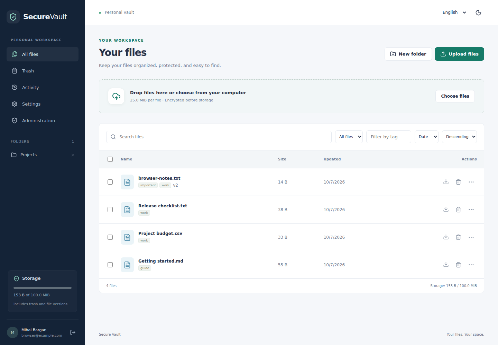

# Secure Vault

A personal file workspace built with FastAPI and React. Organize files, keep earlier versions, recover deleted items, and control access with expiring links.

**[Try the interactive demo](https://kazumi565.github.io/Secure-Vault-Frontend/)** · [Demo setup](https://github.com/Kazumi565/Secure-Vault-Frontend/blob/main/docs/DEMO.md)

Explore sample files, folders, versions, and trash without creating an account. Demo changes stay in tab memory and reset on refresh. Authentication, encryption, and sharing are simulated.



## Features

- **An organized workspace** — folders, tags, filename search, pagination, and sorting by actual file size.
- **Uploads that keep you informed** — drag and drop, multiple files, progress, cancellation, and retry.
- **Recoverable file management** — version history, version restoration, and a configurable trash retention period.
- **Controlled sharing** — expiring download links, optional passwords, download limits, and immediate revocation.
- **Account security** — email verification, Argon2 password hashing, authenticator-based two-factor authentication, recovery codes, and revocable browser sessions.
- **Useful activity records** — personal history, administrator views, and CSV export. Administrative deletion targets a file ID rather than a filename.
- **A responsive interface** — light and dark themes, English and Romanian interface labels, keyboard-accessible dialogs, and mobile layouts.
- **Flexible storage** — local encrypted objects for development or private Amazon S3 storage; SQLite or PostgreSQL for metadata.

New file versions use **AES-256-GCM**. Each version has its own random data key, wrapped by a master key kept outside the database. This is server-side encryption: the application decrypts authorized downloads, and a server operator with the database, objects, and master key can recover their contents. Filenames, tags, account information, and audit records are not encrypted at the application layer.

## Run locally on Windows

Requires Git, Python 3.12, and Node.js 22.12 or later. The frontend is a separate Git submodule.

> Upgrading an existing installation? Start with [the migration guide](docs/MIGRATION.md). The v2 API and database schema replace the original application.

```powershell
git clone --recurse-submodules https://github.com/Kazumi565/Secure-Vault.git C:\Projects\Secure-Vault
Set-Location C:\Projects\Secure-Vault
py -3.12 -m venv .venv
.\.venv\Scripts\python.exe -m pip install -r requirements-dev.txt
.\.venv\Scripts\python.exe scripts\setup_dev.py
.\.venv\Scripts\python.exe -m app.manage upgrade
.\.venv\Scripts\python.exe -m uvicorn app.main:create_app --factory --reload --port 8000 --no-access-log
```

In a second PowerShell window:

```powershell
Set-Location C:\Projects\Secure-Vault\frontend
npm ci
npm start
```

Open **http://localhost:3000**, register, and use the verification link printed in the backend terminal. Development email is written to the console; production requires SMTP. Use `localhost` consistently so that cookies and the configured origin match.

The setup script generates `.env` and a fresh master key. It refuses to overwrite existing settings. Keep a separate secure backup of that key: replacing it makes existing encrypted files unreadable.

To grant administrator access to a registered, verified account:

```powershell
.\.venv\Scripts\python.exe -m app.manage admin --email "you@example.com"
```

### Docker development stack

After generating `.env`:

```powershell
docker compose up --build
```

This starts PostgreSQL, the API, and the frontend at **http://localhost:3000**. Its database and objects live in named volumes, separate from the native SQLite setup. This Compose configuration is for local development. See [operations](docs/OPERATIONS.md) for HTTPS, email, storage, backup, and deployment settings.

## How it fits together

| Part | Responsibility |
| --- | --- |
| `frontend/` | React and Vite client; requests the relative `/api` path |
| `app/auth.py` | Accounts, hashed session tokens, CSRF checks, recovery, and two-factor setup |
| `app/files.py` | Ownership, atomic quota checks, versions, folders, trash, and sharing |
| `app/security.py` | Password hashing, authenticated encryption, and key wrapping |
| `app/storage.py` | Local and S3 object-store adapters |
| `app/maintenance.py` | Expired trash, retryable object cleanup, and queued email delivery |
| `migrations/` | Explicit Alembic migrations; application startup does not create tables |
| `tests/` | Isolated API, security, storage, migration, and recovery tests |

The browser authenticates with an HttpOnly session cookie. Unsafe authenticated requests also require a session-bound CSRF token. Session credentials are not stored in browser localStorage.

The default limits are **25 MiB per upload**, **100 MiB per account**, and **30 days in trash**. Every retained version, including versions in trash, counts toward the account quota. Sharing always serves the current version. Trashing a file revokes its existing links.

## Checks

From the backend repository:

```powershell
.\.venv\Scripts\python.exe -m pytest -q
.\.venv\Scripts\python.exe -m ruff check app tests migrations scripts
.\.venv\Scripts\python.exe -m pip_audit -r requirements.txt
```

From `frontend/`:

```powershell
npm run lint
npm run format:check
npm test
npm run build
$env:VAULT_TEST_PYTHON = (Resolve-Path ..\.venv\Scripts\python.exe).Path
npx playwright install chromium
npm run test:e2e
```

Browser tests start their own temporary backend and frontend on ports 8001 and 3001. They do not use the normal database. GitHub Actions includes SQLite, a dedicated PostgreSQL test service, frontend checks, and Chromium workflows. See [validation notes](docs/VALIDATION.md) for the checks actually run on this update and the remaining environment-specific checks.

## Documentation

- [Migration from the original application](docs/MIGRATION.md)
- [Configuration, backups, key rotation, and deployment](docs/OPERATIONS.md)
- [Security model and limitations](docs/SECURITY.md)
- [Validation and review coverage](docs/VALIDATION.md)
- [Frontend repository](https://github.com/Kazumi565/Secure-Vault-Frontend)

API documentation is available at **http://localhost:8000/docs** during native development. `/healthz` checks the process; `/readyz` checks the database schema and object-store access.
